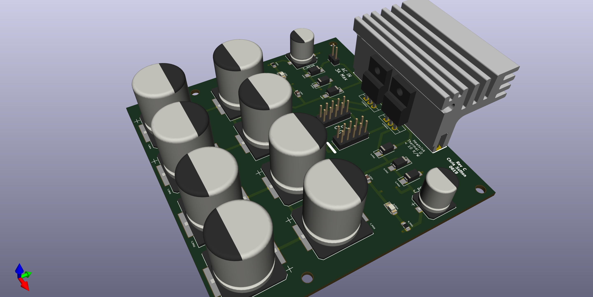

# Full-Wave Voltage Multiplier power supplies

This page contains a design for a bipolar (split +/- voltage rail) linear power supply. It uses variable linear regulators to set the output voltage (via 4 of the resistors).

This design omits the transformer usually found in traditional linear PSU designs. This removes the danger of exposing yourself to lives 240VAC mains. Instead it runs from an AC-AC wall adaptor. *It will not work with an AD-DC wall adaptor!*

A heatsink is also required. The size can vary depending on the current required.

Since the PSU has only two IDC outputs, there is also an extension board available.

 
Both are suitable for use with modular synths systems or as standalone fixed power supplies.

- [Bipolar Linear PSU](Var2IDCAssemblyInstructions.md)

- [Extension board IDCx10](Ext10IDC.md)
