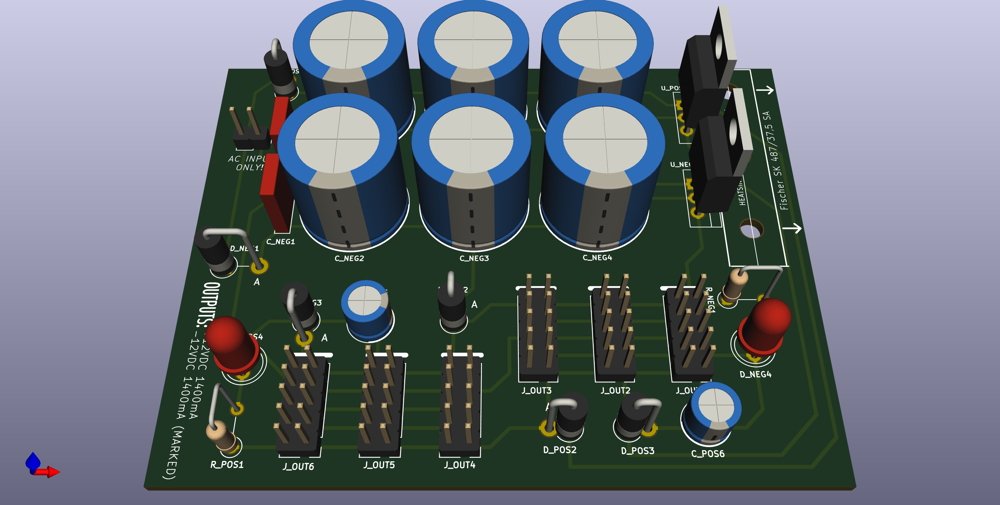
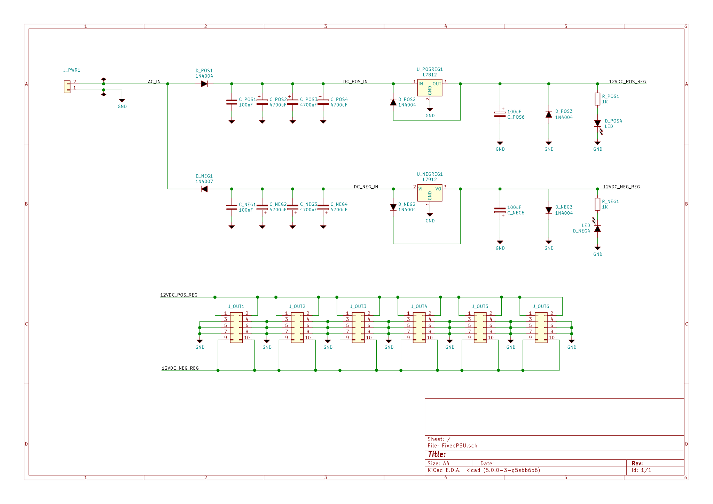

## +/-12V output, dual half-wave PSU

Gerbers and BOM files can found in the doc folders.

Now some random instructions and ramblings...

This unit provides a +12V and -12V DC output voltage without a centre-tapped transformer by using a dual half-wave rectifier design. The transformer must be provided by means of an external plug pack.

*It will not work with an AD-DC wall adaptor*. You must use a AC-AC wall adaptor (12VAC @ 1500mA or higher is recommended). These are not so common today but can be found on Ebay (search for "AC/AC adaptor").

A heatsink is also required for the voltage regulators. Fischer Elektronik SK 574/50 is suggested: https://uk.rs-online.com/web/p/heatsinks/7226909/

Since the PSU has only two IDC outputs, there is also an extension board available.
___
This is a common design that can be found online including - but not limited to - Ray "MFOS" Wilson, FrequencyCentral, numerous textbooks..!

The power input - which is the secondary output from the mains transformer - is split two ways. One side is referenced to ground and the other is rectified by the main circuit. The positive going AC waveform is rectified to positive "DC", smoothed by the bulk capacitors and sent to the positive linear regulator. The negative going AC waveform is rectified to negative "DC", smoothed by the bulk capacitors and sent to the negative linear regulator. LEDs show when the positive/negative halves of the circuit are active.

It's a rather noisy circuit. This is a limitation with the half-wave rectifier design: The changing AC waveform and reverse bias of the rectifier causes the transformer output inductance to collapse periodically and abruptly, causing a voltage spike at the transformer output. Perhaps a snubber network across the inputs would help. A full-bridge-rectifier or SMPS design with adequate filtering would be a better but ultimately, more expensive solution.

The linear regulators help to smooth this output ripple, but they have their limits. As such, to prevent excessive output ripple, it's not recommended that the current draw is taken past ~750mA.

---

This circuit is relatively safe (compared to an offline AC/AC PSU) but common sense should be exercised when it comes to electrical safety.

- Avoid touching the capacitor pins when the LEDs are still lit!  They are bulk capacitors and could be storing a significant charge.

Other than your own personal safety, some pointers on preventing the magic smoke:

- Take care not to mix up the pos/neg regulator ICs. L7912 is the negative regulator and L7812 is the positive regulator!

- If you reverse the polarised caps or diodes they may go *pop* when you power the unit up. You have be warned! :D
