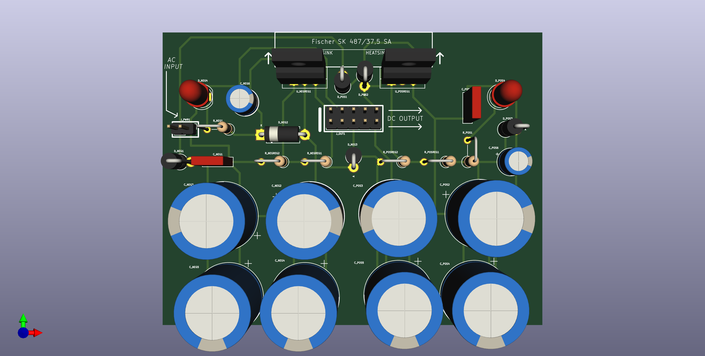

## Bipolar Linear PSU

N.B. *PSU* refers to this PCB circuit, *Wall Adaptor* refers to the AC-AC plug-in wall adaptor.
If not explicitly stated the example - 12V @ 1.5A PSU output from a 15VAC 3A wall adaptor - will be used.

### Some notes regarding safety

Unless you want to make the circuit go bye-bye here are some important notes. *I accept no responsibility for damage to equipment, heightened pulse rate, loss of limbs, etc..*

1) Total max output current is limited to *a)* the wall adaptor output current divided by two *b)* the individual current limit of the diodes *c)* the individual current limit of the regulators.

2) The input current from the wall adaptor must *not* exceed absolute max 80% of the voltage rating of the capacitors. 

3) Polarity of these components *must* be observed or things will explode.

### Adjusting output voltage

The output voltage can be set by changing the four resistors marked on the back of the PCB.

R1     | R2     | Output Voltage  | Min. Filter Cap Rating
|:-----------    |:------------:|:---------------:|:----------:|
120R   |390R    | +/- 5V  | 8V
120R   |750R    | +/- 9V  | 16V
120R   |1K1     | +/-12V  | 20V
150R   |2K      | +/-18V  | 32V
120R   |2K2     | +/-24V  | 35V

The above table is printed - and the specific resistors are highlighted - on the reverse of the PCB. 

### Selecting filter capacitor values

The 16mm diameter electrlytic capacitors filter noise and ripple from the main supply. There are four filter capacitors per power rail, eight in total.

The ripple current for each power rail is proportional to the sum of its four capacitors. Therefore, if you have lower current requirements you can select lower capacitor values without sacrificing acceptable filtering. Use the tables below to select the capacitor values. Note, for practical reasons, these have been rounded to common E12/E24 values.

The table below shows *individual* capacitor values for corresponding output ripple:

Total Current|&nbsp;&nbsp;|Ripple|Each Cap|&nbsp;&nbsp;|Ripple|Each Cap|&nbsp;&nbsp;&nbsp;|Ripple|Each Cap|
|:------------|------|:----:|:------:|--:|:----:|:--------------:|:--:|:----:|:--------------:|
50mA         |       |0.5Vpp|120uF|   |0.3Vpp|220uF|   |0.1Vpp|680uF|
100mA        |       |0.5Vpp|220uF|   |0.3Vpp|470uF|   |0.1Vpp|1200uF|
250mA        |       |0.5Vpp|560uF|   |0.3Vpp|1200uF|   |0.1Vpp|3300uF|
500mA        |       |0.5Vpp|1200uF|   |0.3Vpp|2200uF|   |0.1Vpp|6800uF|
1A           |       |0.5Vpp|2700uF|   |0.3Vpp|3900uF|   |0.1Vpp|120mF|
1.5A         |       |0.5Vpp|3900uF|   |0.3Vpp|5600uF|   |0.1Vpp|240mF|

*Capacitors must not exceed their voltage rating! See safety section above.*

### AC-AC Wall Adaptor

As mentioned this PSU uses low voltage AC, so you will need a AC-AC wall adaptor. This is essentially a step down transformer with (hopefully) a fuse. Here is a well-stocked UK supplier.

[www.poweradaptorsuk.co.uk](https://www.poweradaptorsuk.co.uk/category_s/38.htm) 

You can also try Ebay, etc.

To allow for voltage drop and temp characteristics of the regulator ICs, the wall adaptor voltage output should be slightly above the voltage needed. The wall adaptor current output *must* be double (+/- rails) the current needed.

### Heatsinks

The regulators *will* need a heatsink or they will shutdown before they can output any siginificant current.

This PSU is designed to be used with Fischer Elektronic heatsinks, but any heatsink below the following will meet disipation requirements up to 1.5 amps.

The numbers below assume a 3 volt drop ( 12V output using a 15VAC wall adaptor ) and are for guidance only:

PSU Output Current |  Joint Heatsink  | Two Heatsinks (per heatsink)
|:-----------------|:----------------:|:---------------------------:|
|400mA             |92K/W             |46K/W
|750mA             |45K/W             |22K/W
|1A                |30K/W             |15K/W
|1.5A              |20K/W             |10K/W
|2A                |12K/W             |6K/W

The PCB has max space for ~50mm width.  Screwholes are M3. 

My preference are these clip-type heatsinks that can be used by both regulators:

- [SK 574/37,5 SA](https://uk.rs-online.com/web/p/heatsinks/7226906/) - Shorter but extends beyond PCB footprint
- [SK 575/50 SA](https://uk.rs-online.com/web/p/heatsinks/7226864/)   - Taller but fits within the PCB footprint

