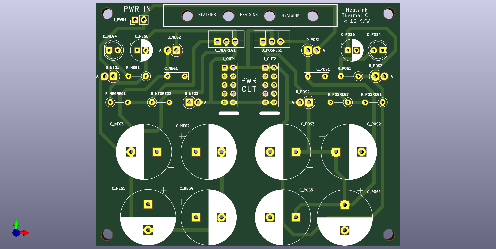

## Programmable dual linear power supply

### Max output current

This is limited by 

- The output current AC-AC plug pack wall adaptor
- The current ratings of the diodes/regulators.

### Adjusting output voltage

The output voltage can be set by changing the four resistors marked on the back of the PCB.

R1     | R2     | Output Voltage  | Min. Filter Cap Rating
-----------:|------------:|---------------:| 
120R   |390R    | +/- 5V  | 8V
120R   |750R    | +/- 9V  | 16V
120R   |1K1     | +/-12V  | 20V
150R   |2K      | +/-18V  | 32V
120R   |2K2     | +/-24V  | 35V

### Selecting filter capacitor values

The 16mm diameter electrlytic capacitors filter noise and ripple from the main supply. There are four per rail, eight in total.

Per rail ripple current is proportional to the sum of the four capacitors. Therefore, if you have lower current requirements you can select lower capacitor values without sacrificing acceptable filtering. Use the tables below to select the capacitor values. Note these have been rounded to common E12/E24 values to ease sourcing and lower cost.

*Capcaitors must not exceed their voltage rating! See 'Adjusting output voltage' section above.*

Total Current   | Farads per cap  | Ripple
---------:|----------------:|-------:
50mA      |  120uF          | 0.5Vpp
100mA     |  220uF         | 0.5Vpp
250mA     |  560uF         | 0.5Vpp  
500mA     |  1200uF         | 0.5Vpp
1A        |  2700uF       | 0.5Vpp
1.5A      |  3900uF       | 0.5Vpp

Total Current   | Farads per cap  | Ripple
---------:|----------------:|-------:
50mA      |  220uF          | 0.3Vpp
100mA     |  470uF         | 0.3Vpp
250mA     |  1200uF         | 0.3Vpp  
500mA     |  2200uF         | 0.3Vpp
1A        |  3900uF       | 0.3Vpp
1.5A      |  5600uF       | 0.3Vpp

Total Current   | Farads per cap  | Ripple
---------:|----------------:|-------:
50mA      |  680uF          | 0.1Vpp
100mA     |  1200uF         | 0.1Vpp
250mA     |  3300uF         | 0.1Vpp  
500mA     |  6800uF         | 0.1Vpp
1A        |  120mF       | 0.1Vpp
1.5A      |  240mF       | 0.1Vpp
