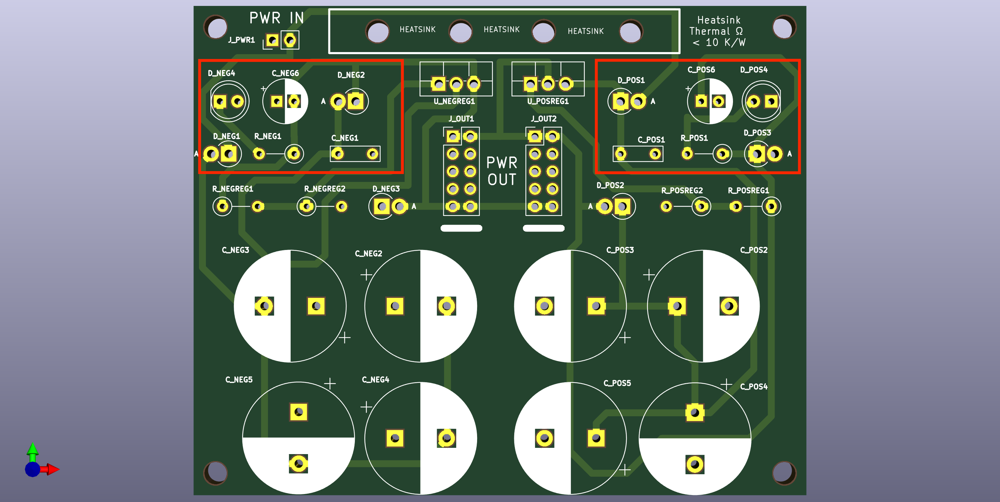
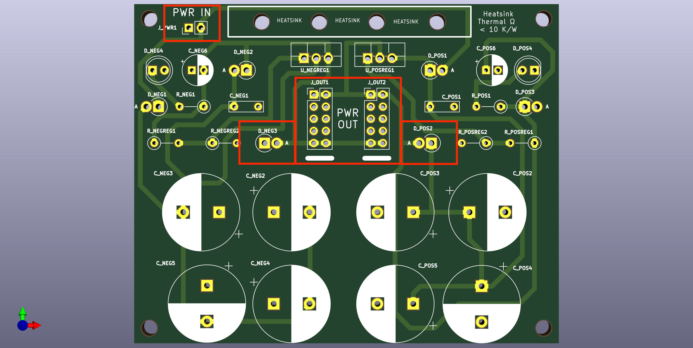
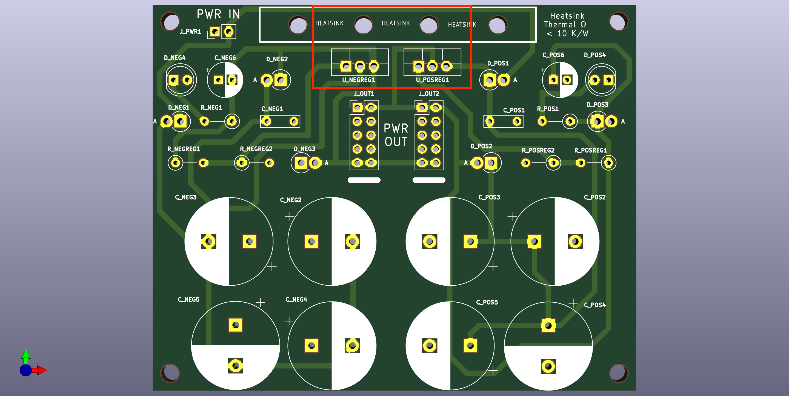
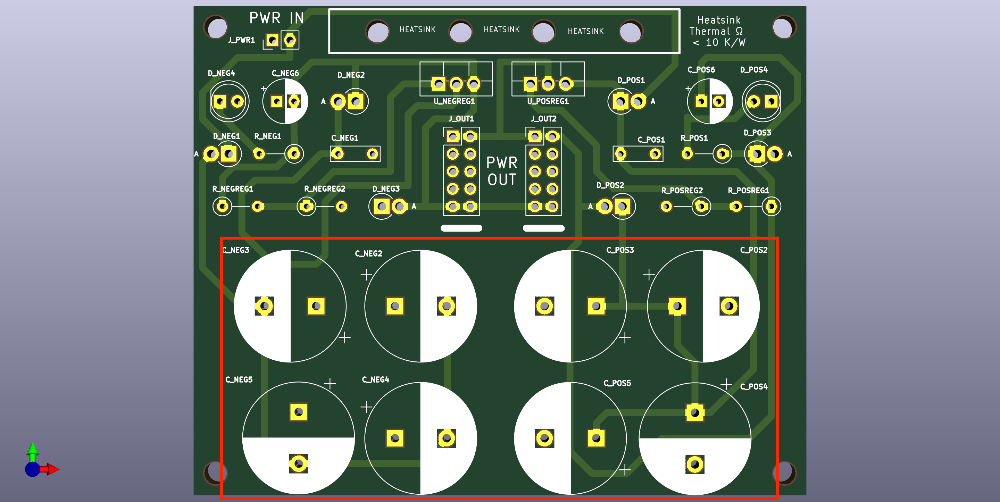

## Variable PSU

### Specifications

- Max Input voltage: 12VAC @ 3A
- Max output Voltage: 12VDC @ 1A
- Load Regulation: 5% 
- Ripple: 0.75 Vpp @ 1A

### Assembly Instructions

1. 

2. 

3. 

4. 

5. 

### Typical Characteristics
|     |     |
|:---:|:---:|
|||
|.svg)|.svg)|
|.svg)|.svg)|
|.svg)|.svg)|
