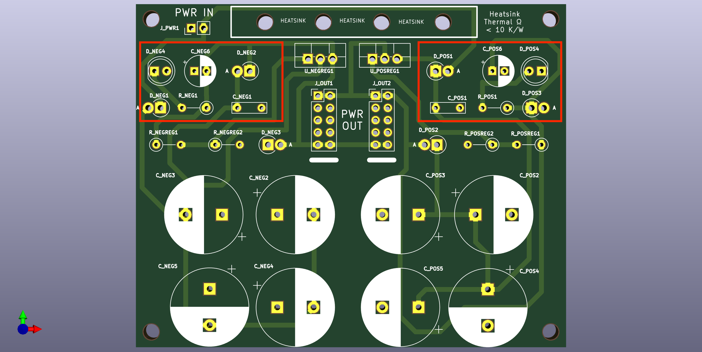
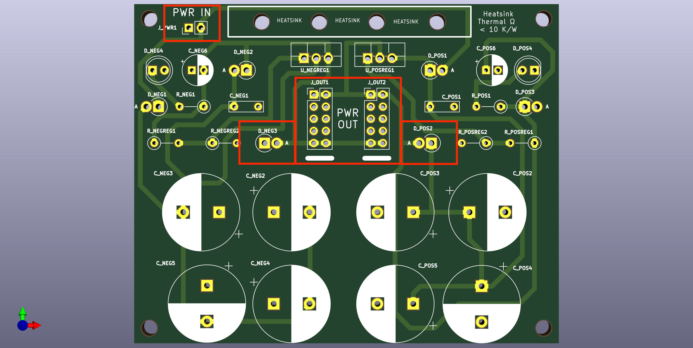
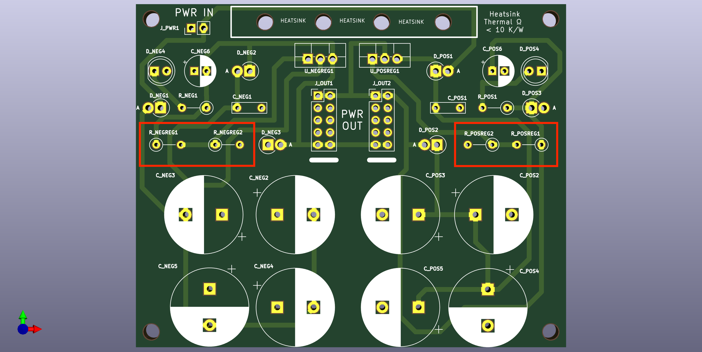
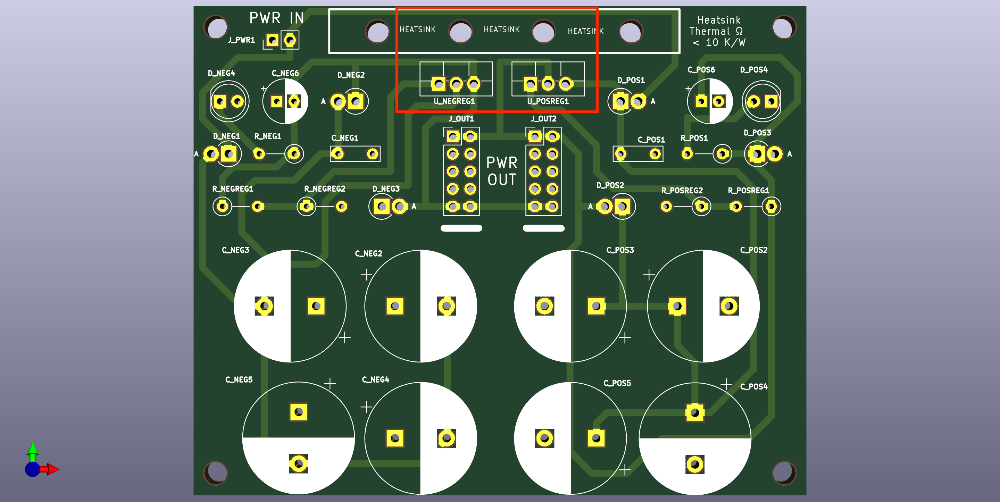
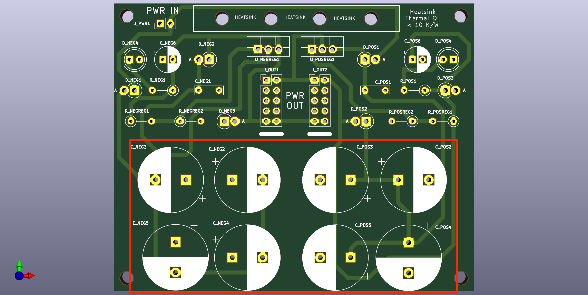

## Variable PSU

### Specifications

- Max Input voltage: 12VAC (16.9VAC RMS) @ 3A (using AC-AC plug pack)
- Max output Voltage: +/- 12VDC @ 2A (1A per rail)
- Load Regulation: 5%
- Ripple: 0.75 Vpp @ 1A

### Assembly Instructions

1. Solder the capacitors, diodes and resistors. Note the polarity of the diodes and caps!

2. Solder the headers and final diodes. Note the polarity of the diodes!

3. Solder the adjustment resistors on the back of the PCB (for esy access)

4. Attach the two ICs to the heatsink using the clips. This should be done *before* soldering the parts to the PCB:

- Line up the IC on the heatsink so that the legs are protruding below the edge of the heatsink.
- Lay the clip on top of the IC so that ridge of the clip is lined up with the notch in the heatsink
- Apply gentle force to the right angle of the clip until it inserts into the notch. A pair of pliers or a *vice* can be useful.

5. Solder the IC legs to the PCB. Attach the heatsink to the PCB using the screwholes, taking care to keep the screws straight as you  turn them.

6. Solder the Electrolytic caps. Note the polarity of the caps!

### Schematic

For reference:

### Typical Characteristics
|     |     |
|:---:|:---:|
|||
|.svg)|.svg)|
|.svg)|.svg)|
|.svg)|.svg)|
